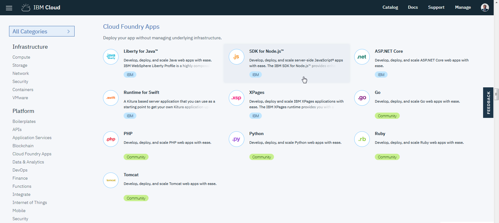
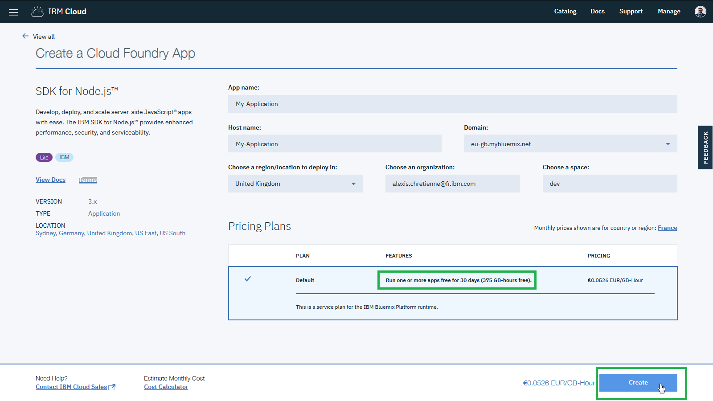
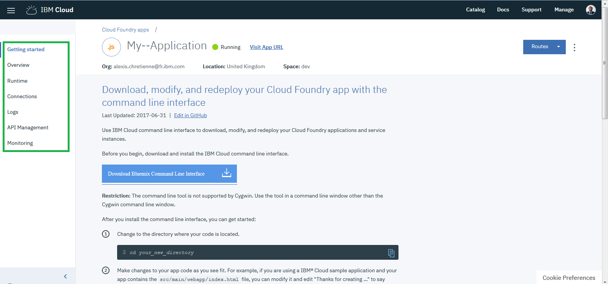

# Financial Risk Management using Machine Learning on z/OS

This journey accesses a Financial Risk Management API published on IBM Cloud with Machine Learning on z/OS running on the IBM Z Mainframe through a simulated retail bank system called MPLbank. 

# MPLbank

## Architecture

This journey accesses a fictitious retail banking system called MPLbank. MPLbank integrates a Financial Risk Management System based on [Machine Learning for z/OS]. The initial predictive model was designed to deliver a score representing the probability of the capacity of loan refund for a banking customer according to their personal data. On top of these components, an API layer hosted in IBM Cloud has been set up to deliver a Financial Risk Management API, illustrating an online decision for loans approval.

Following the below schema, the predictive model was built from data using IBM Machine learning tools. Banking customer data was selected (age, number of credit card, income and number of car loans) to predict a score (probability for capacity of loan refunding) and an action (next customer's behaviour). It was then trained using machine learning with 80% of historical data and evaluated with 20% of the historical data. This ensures the model is able to learn from fresh data.

Once the model was approved, it was deployed to act as a scoring service. On top of this service, an API was created and published to an API developer Portal and is now callable through API. 

The objectives of this journey are to discover, test and use this Financial Risk Management API using a sample financial application, then enhance it using IBM Cloud.

## Included components

The journey is accomplished by using a Hybrid [IBM Cloud] / [IBM Z Mainframe] architecture:

* [Db2 for z/OS]
* [Machine Learning for z/OS]
* [API Connect]
* [Secure Gateway Service]
* [DataPower Gateway]

# Steps

### Part A: Discover and test the Financial Risk Management API

1.	[Start with the API Developer Portal](#1-start-with-the-api-developer-portal)
2.	[Subscribe to the Financial Risk Management API](#2-subscribe-to-the-financial-risk-management-api)
3.	[Work with the Financial Risk Management API](#3-work-with-the-financial-risk-management-api)

### Part B: Make your own Financial Risk Management application

1.	[Download and review the financial application code](#1-download-and-review-the-financial-application-code)
2.	[Run the financial application](#2-run-the-financial-application)

### Part C: Extend the Financial Risk Management application in Cloud

1. 	[Start with Node.js on Cloud](#1-start-with-nodejs-on-Cloud)
2.	[Make a cognitive application using Watson Services](#2-make-a-cognitive-application-using-watson-services)

---

# Part A: Discover and test the Financial Risk Management API

## 1. Start with the API Developer Portal 
1.	Sign up for an [IBM ID] if you don't have one already.

2.	Go to the [API Developer Portal].

3. Create an account if you have not done that already.
	
   * Click **Create an Account**.
   * Provide all required information. Be sure to use your IBM ID (email address) for this account.
   * Click **Submit**.

  
   An account activation email will be sent to your registered IBM ID email. Click on the link in this email to activate your account.

4. Login to your account.

5. Create a new application.
	
	* Click **Apps** from the menu.
	* Click **Create new App**.
	* Fill in all required fields.
	* Click **Submit**.
	
	Make a note of the *client ID* and *client Secret*. You will need them to access the API later.
	

## 2. Subscribe to the Financial Risk Management API 

1.	Before working with the Financial Risk Management API, you need to subscribe to it first. Display the list of available API products.
	
	* Click **API Products** from the top menu.
	* Click **Banking Product** in the list.

2. 	Subscribe to Banking APIs.
	
	* Click **Subscribe** to the Default Plan.
	
	
	* Select the App that you have just created before.
	* Click **Subscribe**.

## 3. Work with the Financial Risk Management API

1.	Go to the Banking API page.
	
	* Click **Banking APIs**.
	
	This page has 3 sections:
   	* The left panel is the navigation panel that lists all the available operations and their definitions. 
    * The middle panel displays detail information for the item you have selected. 
    * The right panel contains sample code in various programming languages.
    
2.	Discover the operation  **Get /customers/loan/calculateScore** by reading its documentation.
	
	* Click **Get /customers/loan/calculateScore**.
    
3.	Generate code for the operation **Get /customers/loan/calculateScore** following the right panel of this operation.
	
	* Click a programming language that you want to work with.
    
   	Sample code for the selected programming language and an example output of a successful response are displayed. You can copy the code and use it in your own application.
  
4. 	Test the operation **Get /customers/loan/calculateScore** in your programming language with Input parameters:
 
 	
	| Parameters            | Value   | example |
	|-----------------------|---------|---------|
	| Age                   | Integer | 23      |
	| Income                | Integer | 30000   |
	| Number of credit Card | Integer | 2       |
	| Number of car loan    | Integer | 1       |
	
	
	* Scroll down to the **Try this operation** section.
	* Fill with Input values.
		> IMPORTANT: All available customers ID are in the */identifier/customerIDs.txt* file in this Github repository. Do not forget to fill the *x-ibm-client-id* and *x-ibm-client-secret* with yours.
	
	* Click **Call Operation**.
	
	You should see the returned output at the bottom of the page. 	
	
	
	
 	A score and a message is returned.
 
---

:thumbsup: Congratulations! You have successfully discovered and tested the Financial Risk Management API.

---

# Part B: Make your own Financial Risk Management application

A quick financial application has been developed in order to help you to start coding. This web application (HTML/CSS/Javascript) uses the Financial Risk Management API introduced before. 

## 1. Download and review the financial application code

1.	Download and import the project *financialApplication* located in **this Github repository** into you preferred IDE like Eclipse.
	
	* Either click on **Download ZIP**
	* Or use Git Command : 
	>	git clone https://github.com/IBM/Financial-risk-management-using-machine-learning-on-zSystems.git

	
2.	Review the *index.html* file in order to understand how it is working.

3.	Review the *financialAPI.js* file in order to understand how the script works.
	
	
	* Replace **IBM_CLIENT_ID** & **IBM_CLIENT_SECRET** variables by yours and save the file.
	
## 2. Run the financial application
	
1.	Open the *index.html* in your favorite web browser. The application will automatically run.
	>	NOTE: There is no need to compile JS/HTML/CSS from any IDE! Just edit those files in the IDE and refresh the *index.html** in the web browser (or Ctrl + F5 shortcut key) to reload this web application. 
	
	

2.	Fill input values with previous values example then Click on the button **Go**. 
	

	This will call the published operation **Get /customers/loan/calculateScore**.
	

---

:thumbsup: Congratulations! You have successfully developed your first financial application.

---

# Part C: Extend the Financial Risk Management application in Cloud

## 1. Start with Node.js on Cloud

1.	[Sign up or login to IBM Cloud]
	
	> NOTE: Use IBM Cloud to create, test and deploy a quick application. Choose among JAVA Liberty Profile, Node.js servers, Ruby, Python, etc. This platform also provides DevOps tools for a continuous delivery (Git, automatic deployment) and a lot of innovative features & services.

2.	Go to the catalog and select **SDK for Node.js**.
	

3.	Configure your Node.js project for free (30 days).
	
	* Provide an App name.
	* Select a domain.
	* Select a region to deploy the project.
	* Click **Create**.

4. 	Wait for the Node.js Runtime creation.

5. 	Once created, explore this panel to be familiar with it.
	
	* Click **Visit App URL**. The default Node.js Project (Hello World) has been provided.
	* Explore each menu on the left panel to understand the Runtime, connections, logs, etc.
 
6.	Follow the **Getting Started** page to learn how to edit, pull and push the provided Hello World application from your computer to your Node.js Runtime in Cloud.
	
	* Read **Prerequisites**.
	* Read **1. Clone the sample app**.
	* Read **2. Run the app locally**.
	* Read **3. Prepare the app for deployment**.
	* Read **4. Deploy the app**.

7.	Edit the cloned Hello World sample application on your laptop to integrate the Financial application files:
	* Copy the *js* folder from the financial application into the *public* folder.
	* Remove the *public/stylesheets** folder to delete the default CSS style.
	* Copy the *css* folder from the financial application into the *public* folder.
	* Replace the *index.html* from the financial application to the *public* folder.
	
	
8.	Re-Deploy the new code to the Node.js Runtime in Cloud using the **cf push** command you learned in step 6.

9.	Re-Click **Visit App URL** on Cloud.
	

The Financial Risk Management application is now hosted in Cloud and use the Finance Risk Management API.

## 2. Make a cognitive application using Watson Services

1.	Integrate [IBM Watson Services] (APIs) from the Cloud catalog. 
	
	* Choose one of them.

2.	Create the service
	
	* Connect to your existing Node.js Project.
	* Click **Create**.
	
3. 	Wait for the chosen Watson Service creation. It will prompt for restaging your Node.js Application. Confirm.

4.	Explore the chosen Watson service in your Node.js Application
	
	* Click **Connections**.
	* Click **Docs**. You will learn how to use this service through APIs.
	* Click **View Credentials**. You will have your API Credentials.
	
5. Develop the chosen Watson service in your Node.js Application using the documentation and credentials.
---

:thumbsup: Congratulations! You have successfully developed your first financial cognitive application in Cloud.

---

[IBM Cloud]: https://www.ibm.com/us-en/marketplace/cloud-platform
[IBM Z Mainframe]: https://www-03.ibm.com/systems/z/

[Machine Learning for z/OS]: https://github.com/IBM/Financial-risk-management-using-machine-learning-on-zSystems/blob/master/Machine-Learning-z-os.md

[Db2 for z/OS]: https://www.ibm.com/analytics/us/en/technology/db2/?lnk=STW_US_SHP_A4_TL&lnk2=learn_DB2

[API Connect]: http://www-03.ibm.com/software/products/en/api-connect

[Secure Gateway Service]: https://www.ibm.com/blogs/Cloud/2017/07/secure-faster-ever-secure-gateway-1-8-0/

[DataPower Gateway]: http://www-03.ibm.com/software/products/en/datapower-gateway

[IBM ID]: https://www.ibm.com/account/us-en/signup/register.html

[API Developer Portal]: https://developer-contest-spbodieusibmcom-prod.developer.us.apiconnect.ibmcloud.com/

[Sign up or login to IBM Cloud]: https://console.bluemix.net/

[IBM Watson Services]: https://www.ibm.com/cloud-computing/Cloud/watson
